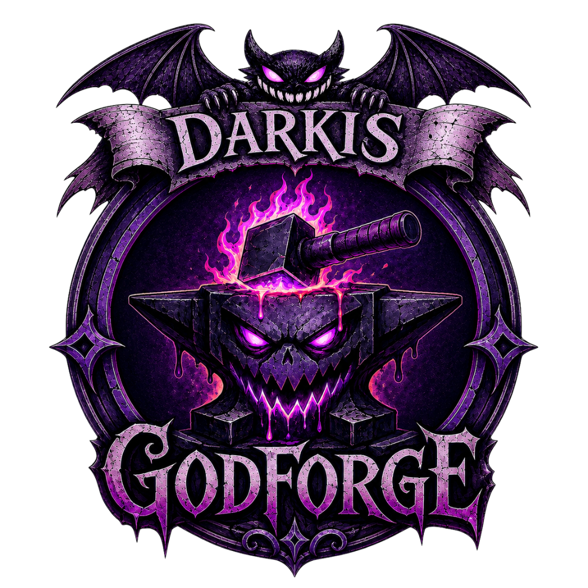

<div align="center">



# Darkis GodForge

### Erschaffe Götter. Forme Glauben. Verändere Welten.

Ein Foundry-VTT-Modul für frei konfigurierbare Homebrew-Gottheiten in<br>
**Pathfinder 2e**, **Starfinder 1e** und **Starfinder 2e**.

[](https://github.com/Darkiyus/Darkis-Godforge/releases/latest)
[](https://foundryvtt.com/)
[](https://github.com/foundryvtt/pf2e)
[](https://foundryvtt.com/packages/)
[](#sprachen--languages)
[](https://github.com/Darkiyus/Darkis-Godforge/releases)

**[Deutsch](#deutsch) · [English](#english) · [Installation](#installation) · [Manifest-URL](https://github.com/Darkiyus/Darkis-Godforge/releases/latest/download/module.json)**

</div>

---

## Deutsch

Darkis GodForge gibt Spielleitungen die Werkzeuge, eigene Gottheiten direkt in Foundry VTT zu verwalten. Erstelle neue Glaubensmächte, ordne Domänen und Fähigkeiten zu, verwalte Segnungen und ersetze auf Wunsch offizielle Gottheiten durch deine eigenen Schöpfungen.

### ✨ Funktionen

- **GodForge-Dashboard** – alle eigenen Gottheiten in einer übersichtlichen Kartenansicht.
- **Gottheiten-Editor** – Name, Titel, Beschreibung, Domänen und Gesinnung direkt in Foundry anlegen.
- **Interaktiver Kodex** – Gottheiten durchsuchen und nach Domänen filtern.
- **Detailansichten** – Beschreibung, Domänen, passive Boni und Fähigkeiten kompakt darstellen.
- **Offizielle Gottheiten einbinden** – vorhandene Gottheiten aus System-Kompendien automatisch erkennen.
- **Ersetzen und Ausblenden** – offizielle Einträge kontextabhängig ersetzen oder ausblenden.
- **Segnungen und Fähigkeiten** – passive Boni, aktive Fähigkeiten sowie verschachtelte Wahlgruppen modellieren.
- **Automatisierbare Effekte** – Schaden, Heilung, Modifikatoren, Zustände, Bedingungen und verzweigte Effekte.
- **Sichere Würfelformeln** – gemischte Formeln wie `3d8 + @actor.level` ohne unsichere Code-Ausführung.
- **Nutzungen und Abklingzeiten** – Aktionen, Auslöser, Dauer, Cooldowns und unterschiedliche Reset-Zeitpunkte.
- **Charakteranbindung** – Gottheiten, gewährte Fähigkeiten und verbleibende Nutzungen an Akteuren speichern.
- **Pathfinder-Klassenintegration** – Unterstützung für gottheitsabhängige Werte von Klerikern und Champions.
- **Mehrsystem-Architektur** – getrennte Adapter für Pathfinder 2e, Starfinder 1e und Starfinder 2e.
- **Persistente Speicherung** – eigene Gottheiten werden als Foundry-Journaldaten im jeweiligen Spiel gespeichert.
- **Import und Export** – versionierte Gottheitsdefinitionen für Backups und Austausch.
- **Deutsch und Englisch** – Oberfläche und Modultexte sind vollständig zweisprachig angelegt.

### 🧩 Unterstützte Systeme

| System | Unterstützung |
|---|:---:|
| Pathfinder 2e | ✅ |
| Starfinder 1e (`sfrpg`) | ✅ |
| Starfinder 2e (`sf2e`) | ✅ |

Darkis GodForge ist für **Foundry VTT v14** geprüft und ab **Foundry VTT v13** freigegeben.

### Installation

#### Empfohlen: Installation über die Manifest-URL

1. Öffne Foundry VTT und wechsle zu **Add-on-Module**.
2. Klicke auf **Modul installieren**.
3. Füge diese URL in das Feld **Manifest-URL** ein:

```text
https://github.com/Darkiyus/Darkis-Godforge/releases/latest/download/module.json
```

4. Klicke auf **Installieren**.
5. Öffne deine Pathfinder- oder Starfinder-Welt unter **Welten verwalten**.
6. Aktiviere unter **Module verwalten** die Module **Darkis GodForge** und **socketlib**.

Foundry lädt über diese URL automatisch die passende aktuelle Veröffentlichung. Zukünftige Aktualisierungen können anschließend direkt über die Foundry-Modulverwaltung installiert werden.

### GodForge öffnen

Nach der Aktivierung können Spielleitungen GodForge auf zwei Wegen öffnen:

1. **Spieleinstellungen → Darkis GodForge → GodForge öffnen**
2. Über das **Hammer-Symbol** in den Token-Werkzeugen der Szenensteuerung

Alternativ steht für Integrationen die Modul-API unter `game.modules.get("darkis-godforge").api` zur Verfügung.

#### Manuelle Installation

1. Lade die aktuelle ZIP-Datei unter [Releases](https://github.com/Darkiyus/Darkis-Godforge/releases/latest) herunter.
2. Entpacke sie als Ordner `darkis-godforge` in dein Foundry-Verzeichnis `Data/modules/`.
3. Starte Foundry neu und aktiviere das Modul in deiner Welt.

### Voraussetzungen

- Foundry VTT 13 oder 14
- Pathfinder 2e, Starfinder 1e oder Starfinder 2e
- [socketlib](https://foundryvtt.com/packages/socketlib) – erforderlich
- [libWrapper](https://foundryvtt.com/packages/lib-wrapper) – empfohlen

---

## English

Darkis GodForge gives Game Masters the tools to manage custom deities directly inside Foundry VTT. Create new divine powers, define domains and abilities, manage blessings, and replace official deities with creations tailored to your world.

### ✨ Features

- **GodForge dashboard** – browse all homebrew deities in a clear card-based overview.
- **Deity editor** – create names, titles, descriptions, domains, and alignments inside Foundry.
- **Interactive codex** – search deities and filter the catalog by domain.
- **Detailed profiles** – display descriptions, domains, passive bonuses, and abilities.
- **Official deity catalog** – automatically discover deity entries from system compendiums.
- **Replace or hide entries** – replace official deities or hide them in selected contexts.
- **Blessings and abilities** – model passive bonuses, active abilities, and nested choice groups.
- **Automatable effects** – damage, healing, modifiers, conditions, conditional branches, and messages.
- **Safe dice formulas** – resolve formulas such as `3d8 + @actor.level` without unsafe code execution.
- **Usage and timing rules** – actions, triggers, durations, cooldowns, and multiple reset events.
- **Actor integration** – store assigned deities, granted abilities, and remaining uses on actors.
- **Pathfinder class coupling** – support deity-dependent Cleric and Champion values.
- **Multi-system architecture** – isolated adapters for Pathfinder 2e, Starfinder 1e, and Starfinder 2e.
- **Persistent storage** – save custom deity definitions as Foundry journal data in each world.
- **Import and export** – exchange and back up versioned deity definitions.
- **German and English** – localized interface and module text for both languages.

### 🧩 Supported systems

| System | Support |
|---|:---:|
| Pathfinder 2e | ✅ |
| Starfinder 1e (`sfrpg`) | ✅ |
| Starfinder 2e (`sf2e`) | ✅ |

Darkis GodForge is verified for **Foundry VTT v14** and supports **Foundry VTT v13** or newer within the declared compatibility range.

### Installation

#### Recommended: install with the manifest URL

1. Open Foundry VTT and select **Add-on Modules**.
2. Click **Install Module**.
3. Paste this address into the **Manifest URL** field:

```text
https://github.com/Darkiyus/Darkis-Godforge/releases/latest/download/module.json
```

4. Click **Install**.
5. Open your Pathfinder or Starfinder world from **Game Worlds**.
6. Enable **Darkis GodForge** and **socketlib** under **Manage Modules**.

Foundry uses this URL to download the current release automatically. Future updates can then be installed directly through Foundry's module manager.

### Opening GodForge

After enabling the module, Game Masters can open GodForge in two ways:

1. **Game Settings → Darkis GodForge → Open GodForge**
2. Select the **hammer icon** in the Token tools of the Scene Controls

Integrations can also access the module API through `game.modules.get("darkis-godforge").api`.

#### Manual installation

1. Download the latest ZIP archive from [Releases](https://github.com/Darkiyus/Darkis-Godforge/releases/latest).
2. Extract it as `darkis-godforge` inside your Foundry `Data/modules/` directory.
3. Restart Foundry and enable the module in your world.

### Requirements

- Foundry VTT 13 or 14
- Pathfinder 2e, Starfinder 1e, or Starfinder 2e
- [socketlib](https://foundryvtt.com/packages/socketlib) – required
- [libWrapper](https://foundryvtt.com/packages/lib-wrapper) – recommended

---

## Sprachen / Languages

Die verwendete Sprache richtet sich automatisch nach der in Foundry gewählten Sprache.<br>
The module automatically follows the language selected in Foundry.

- 🇩🇪 Deutsch
- 🇬🇧 English

## Entwicklung / Development

```bash
npm install
npm run check
```

`npm run check` führt Typprüfung, Linting, Tests und den Produktions-Build aus. Das erzeugte `scripts/main.js` wird absichtlich versioniert, da Foundry das veröffentlichte Modulpaket direkt lädt.

`npm run check` runs type checking, linting, tests, and the production build. The generated `scripts/main.js` is intentionally versioned because Foundry loads the published module package directly.

---

<div align="center">

**Forge the divine. Shape your world.**

[Neueste Version](https://github.com/Darkiyus/Darkis-Godforge/releases/latest) · [Manifest installieren](https://github.com/Darkiyus/Darkis-Godforge/releases/latest/download/module.json) · [Fehler melden](https://github.com/Darkiyus/Darkis-Godforge/issues)

Darkis GodForge ist ein unabhängiges Community-Projekt und steht in keiner offiziellen Verbindung zu Foundry Gaming, Paizo oder den jeweiligen Spielsystem-Projekten.

</div>
